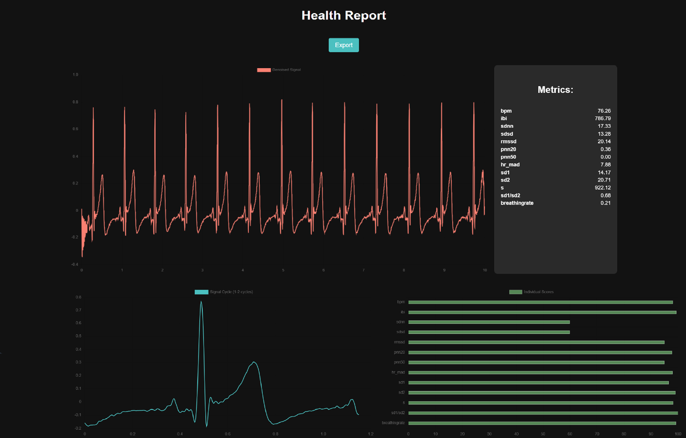

# SUSTech BME IME_Expriment_I_Lab2

## Overview and Announcement
This repository serves as a course project platform for code submission. 

## Features
- **Matlab Integration**: An independent Matlab file `ECG_exported.m ` that interfaces with the NI acquisition card and AD8232 development board GUI, facilitating automatic data saving to the root directory with filenames timestamped.
### ECG_APP Folder
- **Python Web Interface**: A Django-based architecture for user interaction.

## Data Structure

The saved `.mat` file, or the `.mat` file read by the web UI support, contains the following parameters:

- **"fs"**: The sampling frequency of the signal.
- **"v"**: The signal of 2 channels, where `v[:,0]` represents the ground signal, and `v[:,1]` represents the ECG single-ended signal.

## Getting Started
To get started with this project, follow these steps:
1. **Set Up Environment**  
Ensure you have Python and MATLAB installed on your system. Install the required Python packages using pip.

2. **Data Acquisition**  
Use the MATLAB script `ECG_exported.m ` to connect to the NI acquisition card and AD8232 to start data collection. Save the `.mat` file.

3. **Run the Web Interface**  
Navigate to the `ECG_APP` directory and start the Django server. Upload the `.mat` file saved before.

## License
This project is open-source and available under the MIT License.

## Contact
For any questions or further information, please reach out to the maintainers at 12210406@mail.sustech.edu.cn

